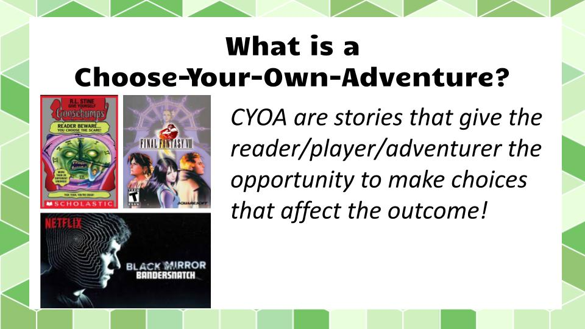
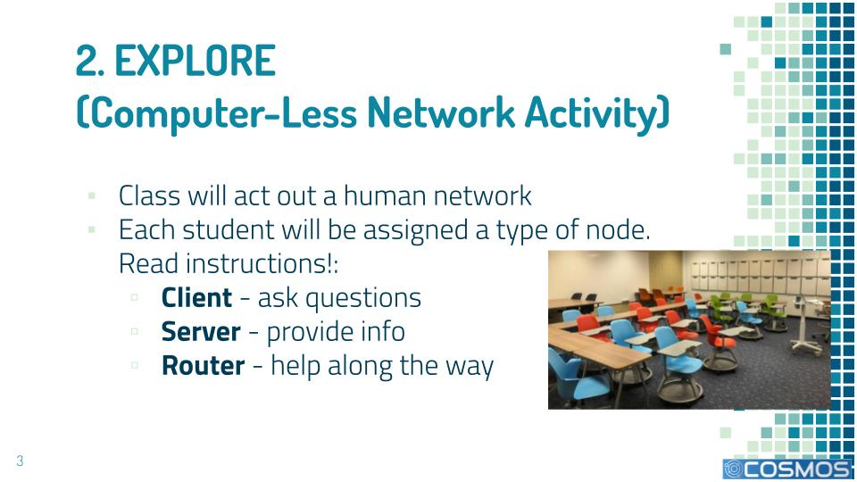

# ASSIGNMENT 00: NYS CS Standards
### Joel Bianchi
### Course: Fall 2022 Curriculum Development

## Instructions:
1. Pick 2 specific NY CS standards
2. Describe a lesson/task/assignment that addresses your selected standards
3. Explain how

* [9-12 Standards](http://www.nysed.gov/common/nysed/files/programs/curriculum-instruction/computer-science-digital-fluency-standards-9-12.pdf)

# TASK 1: CHOOSE YOUR OWN ADVENTURE LAB
* STANDARD: Computational Thinking: Algorithms and Programming: 9-12.CT.8 Develop a program that effectively uses control structures in order to create a computer program for practical intent, personal expression, or to address a societal issue
* PROJECT: "Choose Your Own Adventure Lab": APCSA students use while, if, else structures to create an adventure in which the user can make decisions about what comes next ([Project Curriculum folder](https://drive.google.com/drive/folders/1LJ8Av9Nqbrub4qoBhrrevDxaR8QwCFnw?usp=sharing))

# TASK 2: COMPUTER-LESS NETWORKING
* STANDARD: Networks & System Design: Networks and the Internet: 9-12.NSD.4 Describe the components and design characteristics that allow data and information to be moved, stored, and referenced over the internet
* PROJECT: "Routing Information on the Internet" Lesson: This lesson includes a computer-less activity where students act out how packets of information are encoded and transmitted from a client through routers to a server.  This helps students understand the "magic" behind the hardware (and software) that is needed when they enter a search or request on the internet.
([Lesson Materials Folder](https://drive.google.com/drive/folders/1znciaG40YlNmuR3oRObJrEuH4NuRb6CA?usp=sharing))
